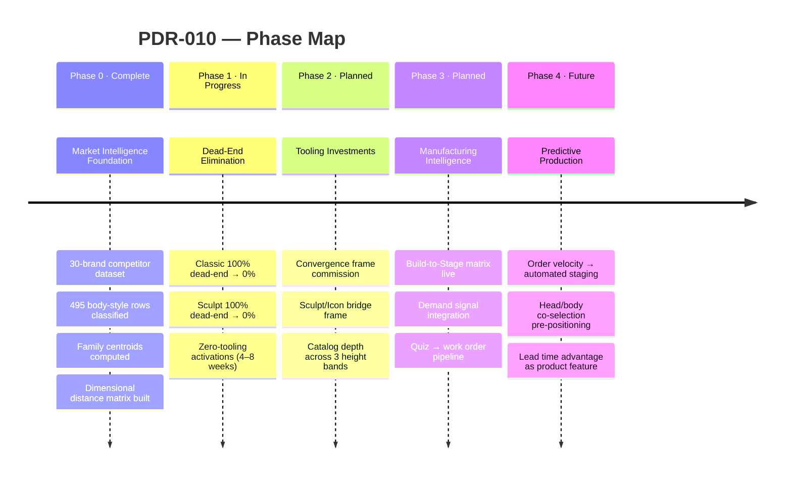
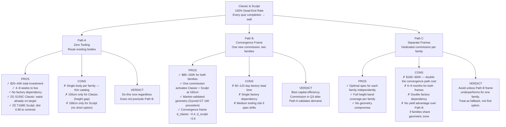
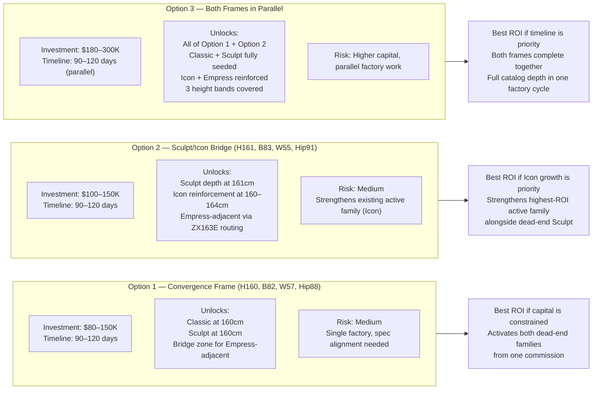
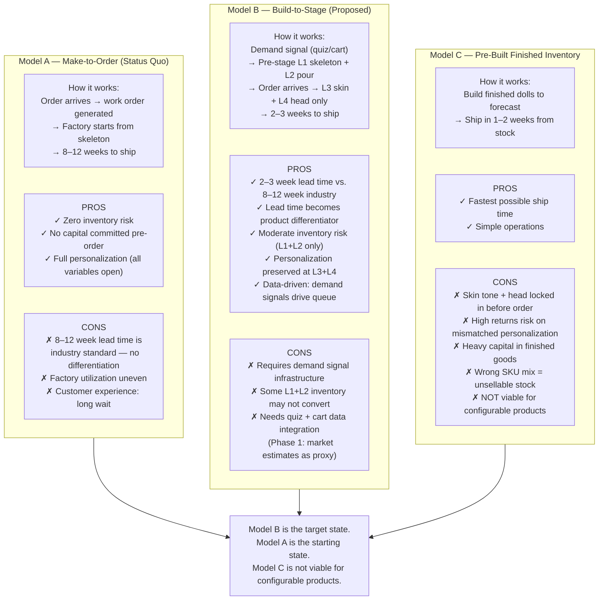
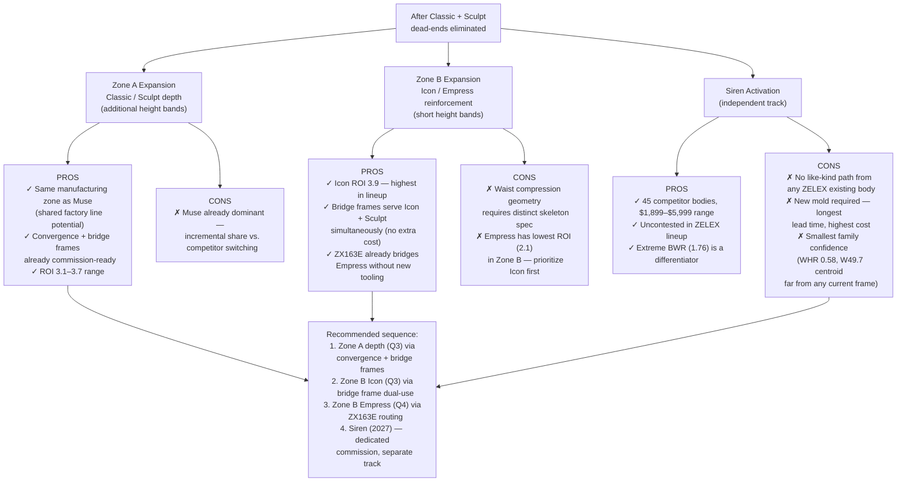
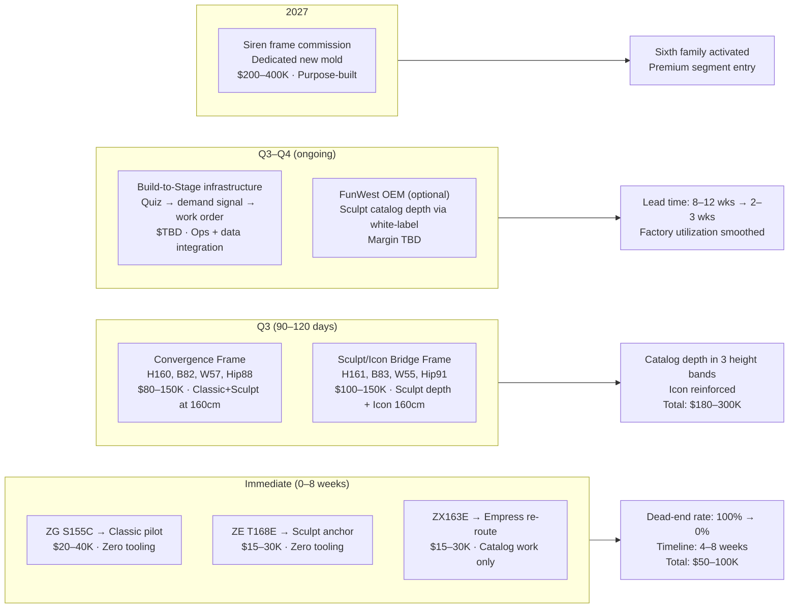

# PDR-010 — ZELEX Family Activation & Manufacturing Intelligence
## Product Decision Record: All Phases

**Date:** 2026-06-06  
**Prepared for:** Howie, CEO  
**Status:** Analyst estimates — not measured ZELEX actuals  
**Branch:** feat/pdr-010-ceo-roi-analysis

---

## What This PDR Covers

This record documents every material decision in the ZELEX family activation initiative — from the market intelligence work already completed, through the dead-end elimination actions required now, through the manufacturing intelligence layer that compounds the value of those investments over time. Each decision point presents the available paths with their trade-offs.

This is not a roadmap of things to do. It is a map of choices, with the costs and consequences of each path made visible so the right sequence can be selected deliberately.

---

## Epic Overview

---

## Decision Point 1 — How to Eliminate Classic & Sculpt Dead-Ends

Both families are at 100% dead-end rate. Three activation paths exist. This is the most urgent decision in the package.

---

## Decision Point 2 — Which Tooling Investments to Make and When

Assuming Path A (zero tooling) is executed immediately, this decision governs the Q3 capital allocation: which frame commissions generate the most cross-family yield.

---

## Decision Point 3 — Manufacturing Model for Production

This governs how the factory stages inventory. Three models exist. The choice determines lead time, inventory risk, and competitive positioning.

---

## Decision Point 4 — Data Signal Maturity Path

The Manufacturing Intelligence Matrix depends on demand signals to assign Tier 1/2/3 confidence. This decision governs what data is used at each phase and what is deferred.

```mermaid
flowchart LR
    subgraph PHASE_NOW["Phase 1 — Market Intelligence Only (Now)"]
        D1_INPUT["Inputs:\nCompetitor data (30 brands)\nFamily centroid distances\nMarket gap coverage %"]
        D1_OUTPUT["Outputs:\nTier assignment by\nfamily + height band\n(estimate, not measured)"]
        D1_LIMIT["Limitation:\nProxy for ZELEX demand —\nnot ZELEX order history"]
    end

    subgraph PHASE_LAUNCH["Phase 2 — Post-Launch Signals (3–6 months)"]
        D2_INPUT["Inputs:\nQuiz completions by family\nCart adds / wishlists\nFirst order velocity data"]
        D2_OUTPUT["Outputs:\nTier assignments calibrated\nto actual ZELEX conversion\nSeasonal pattern emerging"]
        D2_LIMIT["Limitation:\nSmall sample — first 6 months\nmay not be representative"]
    end

    subgraph PHASE_MATURE["Phase 3 — Mature Signals (12+ months)"]
        D3_INPUT["Inputs:\nFull order history\nHead-body co-selection patterns\nRepeat buyer behavior\nSeasonal demand curves"]
        D3_OUTPUT["Outputs:\nPredictive work orders\nAutomatic L1+L2 staging\nHead pre-positioning on\nhigh-confidence co-selection"]
        D3_LIMIT["Limitation:\nRequires data infrastructure\nand system integration"]
    end

    PHASE_NOW -->|"Estimates replaced\nby measured signals"| PHASE_LAUNCH
    PHASE_LAUNCH -->|"Pattern recognition\nover full year"| PHASE_MATURE

    PHASE_NOW --> NOW_ACTION["Action now:\nUse market centroids + gap\ncoverage to assign Tier 1\nfor Classic, Sculpt at\nknown high-gap bands"]
    PHASE_MATURE --> FUTURE_STATE["Future state:\nFactory queue self-populates\nbased on rolling 90-day\norder velocity. Lead time\ndrop is permanent and compounding."]
```

---

## Decision Point 5 — Family Expansion Sequence

Which families to prioritize for catalog expansion beyond Classic and Sculpt.

---

## Investment Summary Across All Paths

---

## Decision Summary for Howie

| Decision | Recommended Path | Why | When |
|----------|-----------------|-----|------|
| Classic dead-end | ZG S155C pilot (zero tooling) | Waist already on-target; body exists | This week |
| Sculpt dead-end | ZE T168E routing (zero tooling) | Distance 0.96 to centroid; body exists | This week |
| Empress depth | ZX163E re-routing (zero tooling) | Distance 1.27 to Empress centroid; no new cost | 4–8 weeks |
| Capital tooling | Convergence Frame (H160, W57) | One commission, two families, market-validated geometry | Q3 |
| Icon reinforcement | Sculpt/Icon bridge frame | Dual-yield: strengthens highest-ROI active family + Sculpt | Q3 |
| Manufacturing model | Build-to-Stage (L1+L2 pre-stage) | Lead time advantage is a product feature, not an ops choice | Phase 3 |
| Siren | Defer to 2027 | No like-kind path; purpose-built commission; lowest urgency | 2027 |

---

*All measurements from 30-brand competitor dataset (495 body-style rows, classified June 2026). Investment ranges are analyst estimates. Not ZELEX actuals.*
